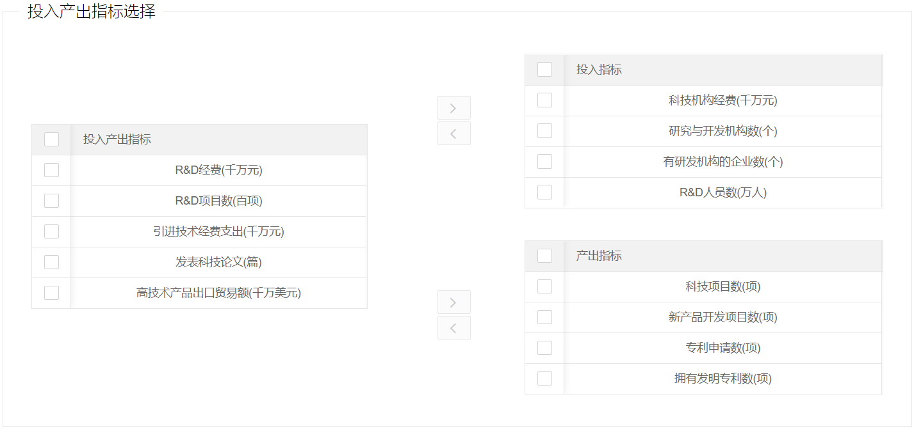

# Layui 三栏穿梭框组件-TransferThree

>项目中需要用到穿梭框组件，且是`左一右二`这种类型的，于是基于[layui-transfer](https://github.com/9499574/layui-transfer) 做了二次开发

- 演示地址：[https://dmego.cn/layui-transferThree/](https://dmego.github.io/layui-transferThree/)

## 截图



## 使用说明

- html 设置数据渲染区域DIV

```html
<div id="transferT"></div>
```

- JS 代码

```javascript
//渲染数据
var tb = transferT.render({
    elem: "#transferT", //指定元素
    cols: [cols1, cols2, cols3], //表格列支持layui数据表格所有配置
    data: [res.target, res.input, res.output], //[左表数据,右上表数据,右下表数据]
    tabConfig: tabConfig //表格配置项 支持layui数据表格所有配置
})

//获取数据
/*transferT.get(p1,p2,p3)
  参数1(p1): 初始化返回值,
  参数2(p2): 获取数据[all,left(l),right1(r1,right2,r2)],
  参数3(p3): 指定数据字段(例如：id)
*/

var all = transferT.get(tb, 'all'); //获取全部数据
var left = transferT.get(tb, 'l', 'id'); //获取左边表数据的所有id值
var right1 = transferT.get(tb, 'r1'); //获取右上表数据
var right2 = transferT.get(tb, 'r2'); //获取右下表数据
```

